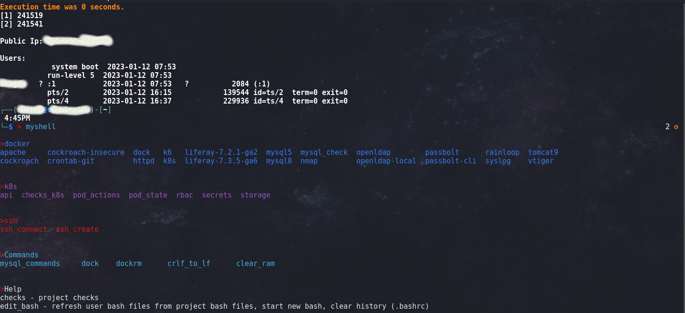
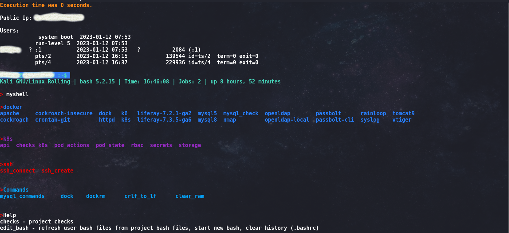
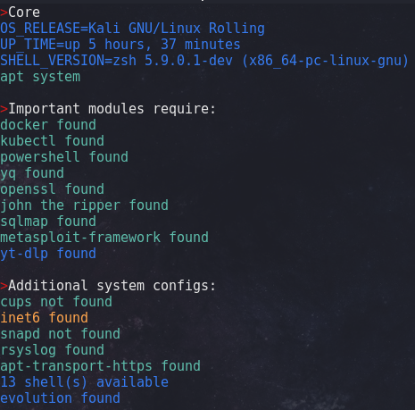

# myshell

## Purpose

Tool for common tasks/test
Three main sections:
- Core: Files for managing profile
- Modules: Section for tools
- Projects: Documentation about developed projects

## Requirements

This tool can be used on almost all apt linux OS (mainly designed for zsh - master branch/bash 5.2+)
It's just an edit of .zshrc/.bashrc file. Once loaded the new profile check for further requirements running "checks".
The recommended shell to use this tool is zsh (master branch).

## How to use

For zsh:
1. Backup your .zshrc file
2. Place core/zsh/.zshrc at $HOME
3. Replace the value for "shell_version" (.zshrc and .bashrc files) to match for your working shell path
4. Modify "project_path" (.zshrc and .bashrc files) and set the path to the project
5. Re/Load shell
6. Run "myshell" to get the avaiable commands to use (you can also use 'alias' command)

zsh

bash

## Some project details:

- shell variable session
- some scripts create random files on /tmp (this random files are removed after the script is done)
- .gitattributes to control LF/CRLF format
- jobs loaded to track public ip change and user shell init
- main functions loaded for other scripts and user shell:
    · colors: possibility to user colors
    · crlf_to_lf: convert all files from current path and recursive exept files like .ps1, .psm1, binaries ... 
    · genera_password: create random strings based on a criteria 
    · script_path: gets the "$0" value for running script

Core files:
core/session (called if exists on .zshrc/bashrc file)
    .var - To create variables for senssitive data like domains into scripts. Added in .gitignore.
    .aliases - Enable aliases.

used tools

"Some project details" section will be improved as the whole project functionality
Some docker images needs data persistence to work properly. This kind of data is not on this project.
